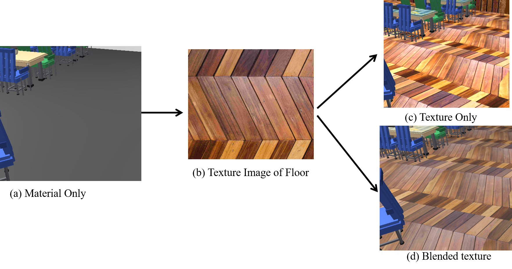
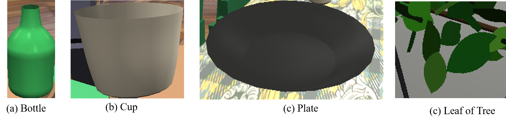
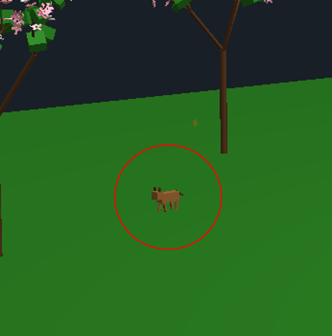

<div align="center">

# 3D Cafeteria

</div>

---

---

# Table of Contents

1. [Introduction](#introduction)
2. [Objectives](#objectives)
3. [Tools and Technologies Used](#tools-and-technologies-used)
4. [Transformation and Scene Construction](#transformation-and-scene-construction)
5. [Objects Used in the Scene](#objects-used-in-the-scene)
6. [Texture Mapping](#texture-mapping)
7. [Shader, Lighting, and Shading](#shader-lighting-and-shading)
8. [Bezier Curve Modeling](#bezier-curve-modeling)
9. [Fractal Tree Generation](#fractal-tree-generation)
10. [Human Walking Animation](#human-walking-animation)
11. [Falling Leafs Simulation](#falling-leafs-simulation)
12. [Cat Movement System](#cat-movement-system)
13. [Results and Discussion](#results-and-discussion)
14. [Conclusion](#conclusion)
15. [References](#references)
16. [List of Figures](#list-of-figures)

---

# List of Figures

| **Figure No.** | **Figure Title** |
|---|---|
| Figure 1 | Overall cafeteria scene |
| Figure 2 | Wall texture comparison in different rendering modes |
| Figure 3 | Floor texture comparison in different rendering modes |
| Figure 4 | Table cloth texture comparison in different rendering modes |
| Figure 5 | Comparison between Gouraud shading and Phong shading |
| Figure 6 | Directional light and point light results |
| Figure 7 | Ambient light and Spot light visual effects |
| Figure 8 | Effect of turning specular light off and on |
| Figure 9 | Bezier curve modeling for bottle, cup, plate, and leaf |
| Figure 10 | Fractal tree |
| Figure 11 | Human movement |
| Figure 12 | Falling leaf from tree |
| Figure 13 | Cat movement |

---

<span style="color:#1F4E79">

# 1. Introduction

</span>

The 3D Cafeteria Simulation project is a real-time computer graphics implementation developed with OpenGL. The main goal of the project is to create a realistic university cafeteria environment that includes both indoor and outdoor components. The scene contains tables, chairs, counters, animated people, a moving cat, Bezier-modeled tableware, trees, and falling leaves. Rather than presenting a static scene, the project integrates mathematical modeling, graphical rendering, and animation techniques to simulate a dynamic real-world environment.

The strength of the project lies in combining multiple graphics concepts in one application. Geometric primitives are used to construct complex objects, lighting and shading models are used for realism, textures improve surface quality, and mathematical equations control motion and procedural generation. As a result, the project demonstrates how computer graphics can combine modeling, illumination, and animation into a complete real-time visual simulation.

<div align="center">
  
  <br>
  <b><span style="color:#1F4E79">Figure 1:</span></b> <span style="color:#444">Overall cafeteria scene.</span>
</div>

---

<span style="color:#1F4E79">

# 2. Objectives

</span>

## Global Objective
- To develop a realistic and interactive 3D university cafeteria simulation using OpenGL.

## Specific Objectives
- To build a complete cafeteria scene using geometric primitives.
- To apply transformations such as translation, rotation, and scaling.
- To implement lighting and shading models for realistic rendering.
- To use texture mapping to enhance visual appearance.
- To generate smooth curved objects using Bezier equations.
- To apply animation using mathematical and time-based functions.

---

<span style="color:#1F4E79">

# 3. Tools and Technologies Used

</span>

The implementation of the project relies on several tools and libraries that support rendering, mathematical computation, interaction, and texture loading.

| **Tool / Library** | **Purpose** |
|---|---|
| OpenGL 3.3 | Core rendering engine for 2D and 3D graphics |
| GLFW | Window creation and input handling |
| GLAD | Loading OpenGL functions |
| GLM | Matrix and vector mathematics |
| stb_image | Texture image loading |
| C++ | Programming language used for the entire implementation |

These tools collectively make it possible to manage transformations, textures, shaders, lighting, and user interaction in a real-time graphics environment.

---

<span style="color:#1F4E79">

# 4. Transformation and Scene Construction

</span>

The cafeteria scene is built using basic geometric primitives such as cubes and cylinders. Complex objects like chairs, tables, counters, columns, and decorative structures are formed by combining these primitives hierarchically. This approach allows small reusable components to be assembled into larger scene elements.

Transformations are applied through matrix operations. The combined modeling transformation is expressed as:

```math
M = T · R · S
```

where:
- `T` is the translation matrix
- `R` is the rotation matrix
- `S` is the scaling matrix

This transformation sequence ensures that each object is placed correctly in the scene with proper position, orientation, and size.

The project scene contains walls, floor, ceiling, service areas, seating arrangements, windows, entrance, bookshelf, terrace, and outdoor enhancements. By combining transformations with geometric modeling, a full cafeteria layout is created.

---

<span style="color:#1F4E79">

# 5. Objects Used in the Scene

</span>

The simulation contains a wide range of objects that together build a complete cafeteria environment. These objects can be categorized into structural, furniture, service, decorative, natural, animated, and outdoor objects.

| **Category** | **Objects** |
|---|---|
| Structural Objects | Floor, walls, ceiling, columns, entrance, windows |
| Furniture Objects | Rectangular tables, round tables, chairs, booth seating, window bar seating |
| Service Area Objects | Serving counter, coffee station, waste station |
| Decorative Objects | Bookshelf, decorative elements, light fixtures |
| Bezier Objects | Plate, cup, bottle, leaf |
| Natural Objects | Fractal trees, flower trees, falling leaves |
| Animated Objects | People, moving cat |
| Outdoor Objects | Terrace, ground surface, parked cars |

Each object contributes to the realism and completeness of the environment. Structural objects define the space, furniture makes the scene functional, natural objects improve visual richness, and animated objects add life to the simulation.

---

<span style="color:#1F4E79">

# 6. Texture Mapping

</span>

Texture mapping is applied to improve the realism of walls, floors, and table surfaces. In texture mapping, every vertex is assigned texture coordinates `(u, v)` that map a two-dimensional image onto a three-dimensional object.

```math
(u,v) ∈ [0,1]
```

The final surface color can be represented conceptually as:

```math
C_final = C_material × C_texture
```

This means that the material color and the sampled texture combine to produce the final appearance of the surface. The project includes three display modes: material only, texture only, and blended texture mode. This makes it possible to compare how textures enhance realism.

<div align="center">
  
  <br>
  <b><span style="color:#1F4E79">Figure 2:</span></b> <span style="color:#444">Wall texture comparison in different rendering modes.</span>
</div>

<div align="center">
  
  <br>
  <b><span style="color:#1F4E79">Figure 3:</span></b> <span style="color:#444">Floor texture comparison in different rendering modes.</span>
</div>

<div align="center">
  
  <br>
  <b><span style="color:#1F4E79">Figure 4:</span></b> <span style="color:#444">Table cloth texture comparison in different rendering modes.</span>
</div>

---

<span style="color:#1F4E79">

# 7. Shader, Lighting, and Shading

</span>

The project compares Gouraud shading and Phong shading to demonstrate different lighting techniques. In Gouraud shading, lighting is calculated at the vertices and interpolated across the polygon. In Phong shading, normals are interpolated and lighting is computed per fragment, producing more accurate highlights and smoother appearance.

The overall illumination model used in the project can be written as:

```math
I = k_a I_a + k_d (N · L) + k_s (R · V)^n
```

where:
- `k_a, k_d, k_s` are the ambient, diffuse, and specular material coefficients
- `I_a` is ambient light intensity
- `N` is the surface normal vector
- `L` is the light direction vector
- `R` is the reflection vector
- `V` is the view direction vector
- `n` is the shininess exponent

## Shader Comparison

The project demonstrates visual differences between Gouraud shading and Phong shading.

<div align="center">
  
  <br>
  <b><span style="color:#1F4E79">Figure 5:</span></b> <span style="color:#444">Comparison between Gouraud shading and Phong shading.</span>
</div>

## Ambient Light

Ambient light gives a constant minimum illumination to all surfaces, preventing them from becoming completely dark.

```math
I_ambient = k_a I_a
```

## Diffuse Light

Diffuse lighting follows Lambert's cosine law and depends on the angle between the normal and the light direction.

```math
I_diffuse = k_d I_l max(0, N · L)
```

This component makes surfaces brighter when facing the light and darker when tilted away.

## Specular Light

Specular lighting produces the shiny highlight effect on reflective surfaces.

```math
I_specular = k_s I_l (R · V)^n
```

A larger value of `n` creates a sharper highlight.

## Point Light Attenuation

Point light intensity decreases with distance. This is modeled as:

```math
I = 1 / (k_c + k_l d + k_q d^2)
```

where:
- `d` is the distance from the light source
- `k_c`, `k_l`, and `k_q` are the constant, linear, and quadratic attenuation factors

This lighting system allows the project to simulate directional light, point light, ambient light, and specular effects in a realistic way.

<div align="center">
  
  <br>
  <b><span style="color:#1F4E79">Figure 6:</span></b> <span style="color:#444">Directional light and point light results.</span>
</div>

<div align="center">
  
  <br>
  <b><span style="color:#1F4E79">Figure 7:</span></b> <span style="color:#444">Ambient light and Spot light visual effects.</span>
</div>

<div align="center">
  
  <br>
  <b><span style="color:#1F4E79">Figure 8:</span></b> <span style="color:#444">Effect of turning specular light off and on.</span>
</div>

---

<span style="color:#1F4E79">

# 8. Bezier Curve Modeling

</span>

Smooth curved objects such as the bottle, cup, plate, and leaf are created using cubic Bezier curves. A cubic Bezier curve is defined as:

```math
B(t) = (1-t)^3 P_0 + 3(1-t)^2 t P_1 + 3(1-t)t^2 P_2 + t^3 P_3
```

where:
- `P_0`, `P_1`, `P_2`, and `P_3` are control points
- `t ∈ [0,1]`

This equation generates a smooth parametric curve starting from `P_0` and ending at `P_3`, while `P_1` and `P_2` control the curve shape.

To convert the 2D Bezier profile into a 3D object, a surface of revolution is used:

```math
x = r cos θ
```

```math
y = h
```

```math
z = r sin θ
```

Here:
- `r` is the radius obtained from the curve profile
- `h` is the height value
- `θ` is the angle of rotation

This method creates smooth 3D surfaces suitable for rotationally symmetric objects like plates, bottles, and cups.

<div align="center">
  
  <br>
  <b><span style="color:#1F4E79">Figure 9:</span></b> <span style="color:#444">Bezier curve modeling for bottle, cup, plate, and leaf.</span>
</div>

---

<span style="color:#1F4E79">

# 9. Fractal Tree Generation

</span>

The project uses recursive fractal techniques to generate realistic tree structures. Fractal trees are constructed by repeatedly creating smaller child branches from parent branches.

The branch length follows the recursive formula:

```math
L_{d+1} = s_L · L_d
```

where:
- `L_d` is the branch length at depth `d`
- `s_L` is the scaling factor for length

Similarly, branch thickness is reduced recursively by:

```math
T_{d+1} = s_T · T_d
```

where:
- `T_d` is the thickness at depth `d`
- `s_T` is the thickness scaling factor

Branch direction is controlled by yaw and tilt angles:

```math
θ_yaw = θ_base + Δθ
```

```math
θ_tilt = θ_min + Δθ
```

The yaw angle controls the horizontal spread of branches, while the tilt angle controls how much the branch bends upward.

Wind motion is simulated with a sine function:

```math
θ = A sin φ
```

where:
- `A` is the amplitude
- `φ` is the phase

This creates a natural oscillating sway in the branches.

<div align="center">
  
  <br>
  <b><span style="color:#1F4E79">Figure 10:</span></b> <span style="color:#444">Fractal tree.</span>
</div>

---

<span style="color:#1F4E79">

# 10. Human Walking Animation

</span>

The project includes animated people whose motion is controlled mainly by trigonometric functions. Human walking is periodic, so sine functions are suitable for representing smooth and repeated movement.

The general oscillatory motion is written as:

```math
θ = A sin(t)
```

where:
- `θ` is the angle of the limb
- `A` is the amplitude
- `t` is time

For walking, the left and right legs move in opposite phase:

```math
θ_L = 35 sin(t)
```

```math
θ_R = 35 sin(t + π)
```

This phase difference of `π` ensures that while one leg moves forward, the other moves backward.

Knee bending can be represented as a conditional expression:

```math
knee angle =
{
-1.5θ_L, if the leg is backward
0, otherwise
}
```

Arm movement is opposite to leg motion, which reflects natural human gait:

```math
θ_arm = -0.8 × θ_leg
```

The position of a moving character is updated using:

```math
P_new = P_old + v⃗ · Δt
```

where:
- `v⃗` is the velocity vector
- `Δt` is the time step

These equations allow the animated people to move smoothly and realistically in the cafeteria environment.

<div align="center">
  
  <br>
  <b><span style="color:#1F4E79">Figure 11:</span></b> <span style="color:#444">Human movement.</span>
</div>

---

<span style="color:#1F4E79">

# 11. Falling Leafs Simulation

</span>

The falling leaf system combines gravity, flutter, and wind motion to simulate natural leaf movement.

The vertical velocity decreases due to gravity:

```math
v_y = v_y - 0.8 Δt
```

To create a fluttering effect, an oscillatory term is added:

```math
v_y = v_y + 0.15 Δt sin(3ω · Time + θ)
```

Wind affects the horizontal movement in the `x` and `z` directions:

```math
v_x = 0.08 ω_str sin(2ω · Time + 0.01θ)
```

```math
v_z = 0.05 ω_str cos(1.5ω · Time + 0.02θ)
```

The updated position of a leaf becomes:

```math
x_new = x + v_x Δt
```

```math
y_new = y + v_y Δt
```

```math
z_new = z + v_z Δt
```

These equations produce a more realistic effect than simple straight downward motion, because the leaves drift sideways and flutter as they fall.

<div align="center">
  
  <br>
  <b><span style="color:#1F4E79">Figure 12:</span></b> <span style="color:#444">Falling leaf from tree.</span>
</div>

---

<span style="color:#1F4E79">

# 12. Cat Movement System

</span>

The project includes a moving cat as an animated object in the environment. The cat moves on the `x-z` plane and follows target-based directional motion.

The basic motion relation is:

```math
P(t) = P_0 + vt
```

where:
- `P_0` is the initial position
- `v` is velocity

For movement toward a target, the update equation is:

```math
P(t + Δt) = P(t) + d̂ · v · Δt
```

where `d̂` is the normalized direction vector:

```math
d̂ = (P_target - P) / |P_target - P|
```

This ensures that the cat always moves toward the current target point.

The tail and leg movement are controlled by sine-based animation:

```math
θ_tail = A sin(φ)
```

```math
θ_leg = A sin(2φ)
```

These equations create rhythmic motion and make the cat appear more natural and alive.

<div align="center">
  
  <br>
  <b><span style="color:#1F4E79">Figure 13:</span></b> <span style="color:#444">Cat movement.</span>
</div>

---

<span style="color:#1F4E79">

# 13. Results and Discussion

</span>

The project successfully demonstrates a realistic and interactive 3D cafeteria environment. It integrates transformations, texture mapping, multiple lighting effects, shading models, Bezier curve modeling, fractal tree generation, and animation systems into a single real-time application.

The use of Bezier curves allows smooth and visually appealing curved objects. Fractal techniques generate natural tree structures, while trigonometric functions create believable human and animal motion. Texture mapping and lighting improve the appearance of surfaces and produce a more immersive scene.

Overall, the project is a practical and technically rich implementation of computer graphics concepts.

---

<span style="color:#1F4E79">

# 14. Conclusion

</span>

In conclusion, the 3D Cafeteria Simulation project effectively combines geometric modeling, transformations, texture mapping, lighting, shading, Bezier surface generation, fractal modeling, and animation into a complete real-time graphics application. The work demonstrates how mathematical equations can be applied directly to visual simulation in computer graphics.

The project not only fulfills the stated objectives but also provides a strong foundation for future work in interactive scene design, real-time simulation, and advanced graphics applications.

---

<span style="color:#1F4E79">

# 15. References

</span>

1. Lab Lecture Slide
2. https://registry.khronos.org/OpenGL-Refpages/gl4/
3. https://www.glfw.org/documentation
4. https://glm.g-truc.net/0.9.9/api/index.html

